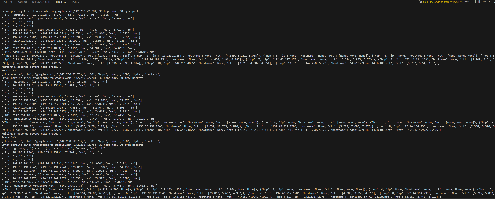
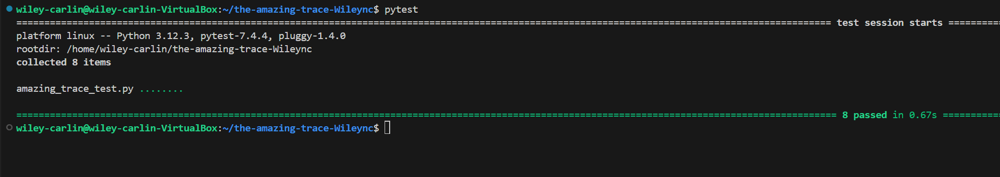
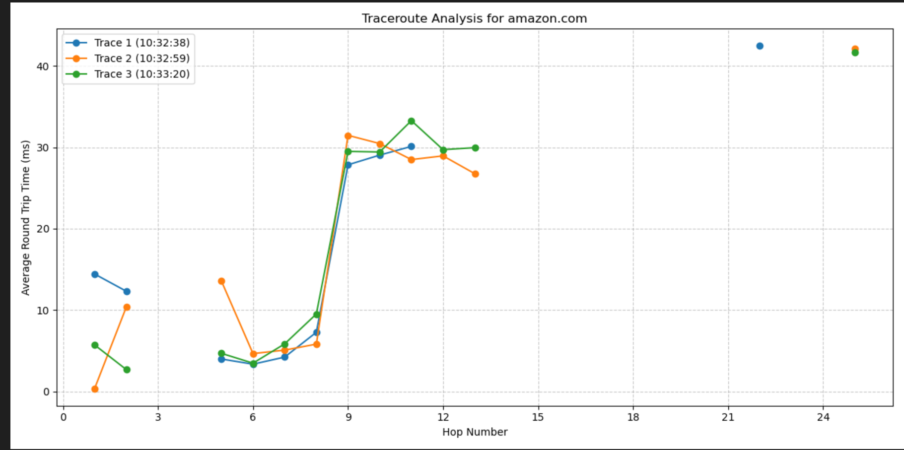
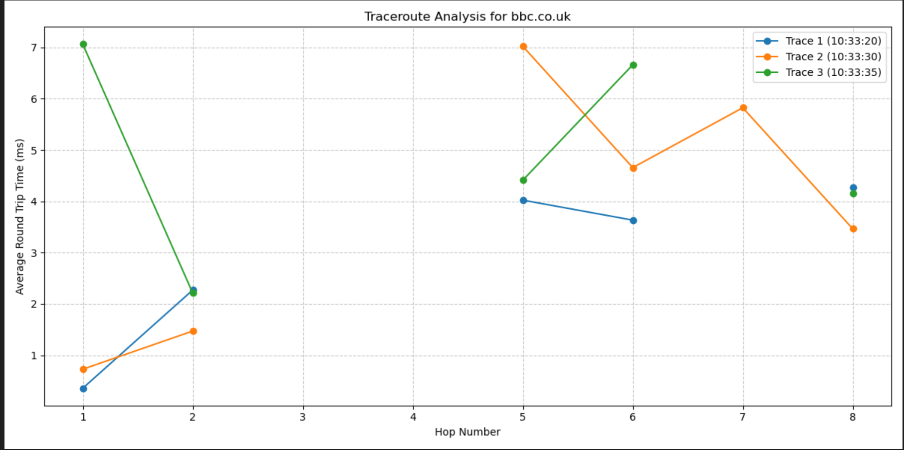
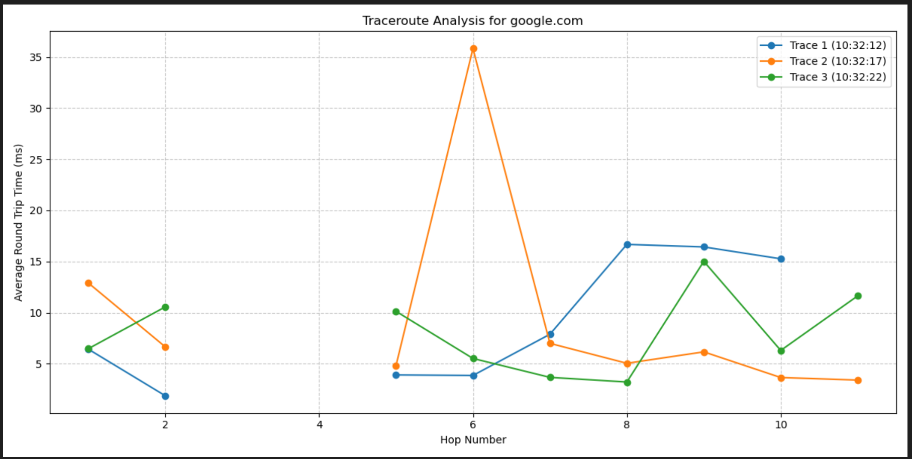

# Our Amazing Trace

In this assignment we coded two functions:
1. A function that sends out traceroute requests to given domains
2. A function that takes the output from the first function and formats the information into a useable way.

## Why?
We did this because it is a great way to see how information flows bettween servers to get to a specific server.
When I request to go to **google.com**, I send out the request and it travels from server to server until it gets to one of Google's servers. It makes about 10-15 hops on the way.

## How do we run it and what does it look like?
To run our code, you would would type in the terminal...
```
sudo python3 amazing_trace.py
```
The image above is the output you would get. A seris of hops, ips, hostnames and times it took to make that hop.
It looks like this...
```
['10', 'den16s08-in-f14.1e100.net', '(142.250.72.46)', '15.949', 'ms', '15.737', 'ms', '14.107', 'ms']
```
1. "10" being the hop number. 
2. "den16s08-in-f14.1e100.net" being the hostname. 
3. "142.250.72.46" being the ip address.  
4. **"15.949"**, **"15.737"**, **"14.107"** being the route times in miliseconds.

When we use the built in tests and we enter...
```
pytest
```
we get this output...

We see that all of the tests pass.

## Here are the graphs for our traceroutes...
## amazon.com


## bbc.co.uk


## google.com
